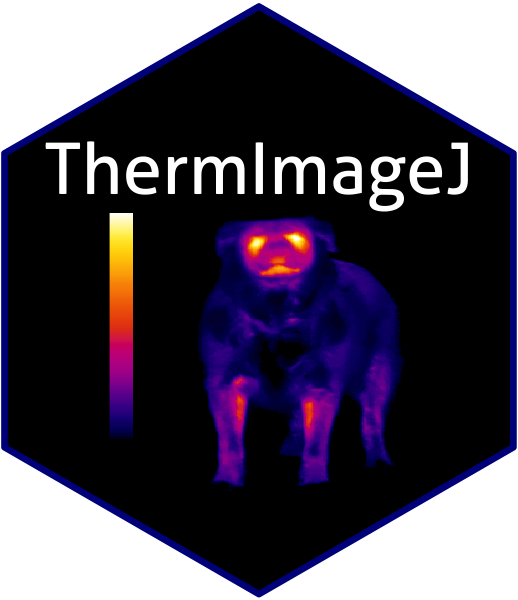
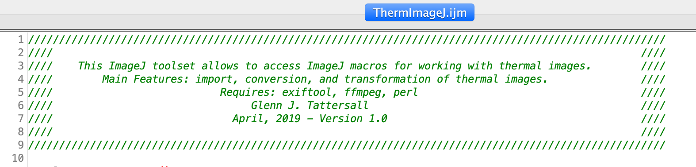
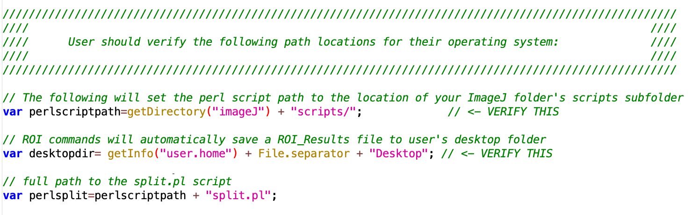
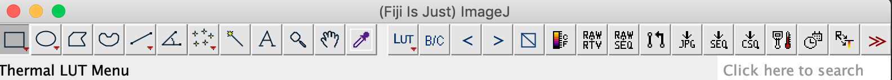

ThermImageJ - Thermal Image Functions and Macros for ImageJ
================



ThermImageJ is a collection of ImageJ functions and macros to allow for import and conversion of thermal image files and to assist in extracting raw data from infrared thermal images and converting these to temperatures using standard equations in thermography.

These macros will allow you to import most FLIR jpgs and videos and process the images in ImageJ.

ThermImageJ emerged from Thermimage (<https://github.com/gtatters/Thermimage>), the latter an R package with similar tools but more emphasis on biological heat transfer analysis.

Compatibility
-------------

-   ThermImageJ was developed on OSX, and tested using ImageJ v1.52o. Many features require installation of command line tools that may present future challenges on different operating systems. Testing and troubleshooting is ongoing, especially in Windows. Please report issues here: <https://github.com/gtatters/ThermImageJ/issues>, or consider converting to Mac or Linux.

How to Cite
-----------

-   Glenn J. Tattersall. (2019). ThermImageJ: Thermal Image Functions and Macros for ImageJ. <doi:10.5281/zenodo.2652896>. [](https://zenodo.org/badge/latestdoi/182273995)

Requirements
------------

### External Software Downloads

-   FIJI is Just ImageJ. Download instructions: <https://imagej.net/Fiji/Downloads>
-   Exiftool. (The standalone executable file is suggested). Installation instructions: <http://www.sno.phy.queensu.ca/~phil/exiftool/install.html>
-   FFMPEG command line utility (static version). Download instructions: <https://ffmpeg.org/download.html>
-   Perl. (Activeperl binary is suggested) Installation instructions: <https://www.perl.org/get.html>
-   Byte swapper plugin. Download instructions: <https://imagej.nih.gov/ij/plugins/swapper.html>

### ThermImageJ Downloads from this Github site

-   A custom perl script (split.pl), provided on this github repository, which can be downloaded and placed in a scripts folder with ImageJ: <https://github.com/gtatters/ThermImageJ/tree/master/scripts/split.pl>
-   ThermImageJ macro toolset. A text file (.ijm) containing all the macros and functions: <https://github.com/gtatters/ThermImageJ/tree/master/toolsets/ThermImageJ.ijm>
-   Additional Look Up Tables (LUTS), popularly used in thermal imaging, available on this github repository: <https://github.com/gtatters/ThermImageJ/tree/master/luts>

Note: ThermImageJ files can be easily downloaded as a ZIP file by clicking on the green **Clone or Download** button and then selecting **Download ZIP** (<https://github.com/gtatters/ThermImageJ/archive/master.zip>), or by going to the **Recent Releases** (<https://github.com/gtatters/ThermImageJ/releases>) and selecting the **Source Code** link for the most recent release. Unzip this folder on your computer for access to the toolset, luts, and the split.pl files located in their appropriate subfolders.

Installation Instructions
-------------------------

-   Install **FIJI**, **exiftool**, **perl**, and **ffmpeg** according to the website instructions above.
-   Troubleshoot or perform installation checks (see next section).
-   Launch **FIJI** and follow any update instructions.
-   Launch FIJI--&gt;Help--&gt;Update, allow it to update any plug-ins, then while the update window is open, select **Manage update websites**, and ensure that the FFMPEG box is ticked. Select **ok**, then click the **Apply** option, and restart FIJI. This FFMPEG plugin is required for importing avi files created during the conversion process, although it might require that you have FFMPEG installed at the command line.
-   Navigate to where FIJI is installed to find all the subfolders. On a Mac, you may need to right-click on FIJI and click **Show Package Contents** to open up FIJI as a folder to reveal the various folders (macros, plugins, jars, etc..)
-   Download the **ThermImageJ.ijm** file from this site and copy into the FIJI/macros/toolsets folder.
-   Open the **ThermImageJ.ijm** file in any text editor, and verify the paths are properly set for your respective operating system. See the comments with the text file for guidance.
-   Download the additional **luts** files from this site and copy into your FIJI/luts folder. These are palettes that are commonly used in thermal imaging.
-   Download the perl script, **split.pl** from this site and copy into a FIJI/scripts folder.
-   Download **Byte\_Swapper.class** to the plugins folder.
-   Restart ImageJ.
-   If everything succeeded (see checks below), the toolset should be installed and visible from your plugins menu.

Installation Checks
-------------------

Verify exiftool is installed by launching a terminal (or cmd prompt) window and typing the following bash commands:

``` bash
exiftool -ver
which exiftool
```

    ## 11.37
    ## /usr/local/bin/exiftool

If you see a version number (probably &gt; 10) and no error, then exiftool is installed properly. The second line will tell you the path to where it is installed.

Do the same for perl:

``` bash
perl -ver
which perl
```

    ## 
    ## This is perl 5, version 18, subversion 2 (v5.18.2) built for darwin-thread-multi-2level
    ## (with 2 registered patches, see perl -V for more detail)
    ## 
    ## Copyright 1987-2013, Larry Wall
    ## 
    ## Perl may be copied only under the terms of either the Artistic License or the
    ## GNU General Public License, which may be found in the Perl 5 source kit.
    ## 
    ## Complete documentation for Perl, including FAQ lists, should be found on
    ## this system using "man perl" or "perldoc perl".  If you have access to the
    ## Internet, point your browser at http://www.perl.org/, the Perl Home Page.
    ## 
    ## /usr/bin/perl

Verify no errors on your system to ensure perl is installed correctly.

Check that the perl script is accessible by perl (be sure to provide the proper path to the split.pl file on your system):

``` bash
perl /Applications/Fiji.app/scripts/split.pl
```

You should see the following warning message:

*"Error: Please specify input file, output folder, the output filename base, pattern to split, and output file extension."*

This is a good error, and verifies that the perl script is installed where your machine can access it!

If you see:

*"Can't open perl script "/Applications/Fiji.app/scripts/split.pl": No such file or directory"*

you will need to re-check the location of the script or the path information provided at the top of the ThermImageJ.ijm file.

Now, do the same for ffmpeg:

``` bash
ffmpeg -version
which ffmpeg
```

    ## ffmpeg version 4.1 Copyright (c) 2000-2018 the FFmpeg developers
    ## built with Apple LLVM version 10.0.0 (clang-1000.11.45.5)
    ## configuration: --prefix=/usr/local/Cellar/ffmpeg/4.1_1 --enable-shared --enable-pthreads --enable-version3 --enable-hardcoded-tables --enable-avresample --cc=clang --host-cflags= --host-ldflags= --enable-ffplay --enable-gpl --enable-libmp3lame --enable-libopus --enable-libsnappy --enable-libtheora --enable-libvorbis --enable-libvpx --enable-libx264 --enable-libx265 --enable-libxvid --enable-lzma --enable-opencl --enable-videotoolbox
    ## libavutil      56. 22.100 / 56. 22.100
    ## libavcodec     58. 35.100 / 58. 35.100
    ## libavformat    58. 20.100 / 58. 20.100
    ## libavdevice    58.  5.100 / 58.  5.100
    ## libavfilter     7. 40.101 /  7. 40.101
    ## libavresample   4.  0.  0 /  4.  0.  0
    ## libswscale      5.  3.100 /  5.  3.100
    ## libswresample   3.  3.100 /  3.  3.100
    ## libpostproc    55.  3.100 / 55.  3.100
    ## /usr/local/bin/ffmpeg

Setting and verifying paths to command line tools
-------------------------------------------------

Once you have installed everything above, and verified no errors, you can check or change the directory paths in FIJI/ImageJ.

The ThermImageJ.ijm toolset file will detect whether you are using Mac OSX, Linux or Windows and attempts to define the appropriate file paths automatically. Thus, you should not need to change parameters, but it is useful to check and become familiar with the process or do any customisation necessary for your FIJI installation.

Navigate to the ThermImageJ.ijm toolset file and open it using a text editor or the built-in ImageJ macro editor:



Depending on your operating system or how system files are installed you may need to edit the specific path locations for your respective system:


This also applies to the location of the split.pl file that should be placed in the scripts folder inside the Fiji folder.

ThermImageJ assumes you have placed the split.pl file into a scripts subfolder where Fiji is installed, so hopefully you will not need to change this:



Setting ThermImageJ Macros Up in FIJI/ImageJ
--------------------------------------------

Once you have installed everything above, and verified no errors, you can set the macros up in FIJI/ImageJ.

Launch FIJI, left click the **more-tools menu**, which is the **&gt;&gt;** on the far right side of the menu bar:


Which will reveal any of the toolsets in the folder. Click on **ThermImageJ** to replace the present icons with ThermImageJ specific icons / macros:


Once installed, the toolbar menu populates with new icons corresponding to the primary ThermImageJ functions:



Once installed, the toolset should also populate the **Plugin Dropdown Menu** with the same, and some additional macros used less often:


Customising the Toolset
-----------------------

Feel free to edit your version of ThermImageJ.ijm and if you break it, you can always download a new one.

You can edit it with any text editor or with the built-in ImageJ text editor by selecting Plugins--&gt;Macros--&gt;Edit and navigating to the Fiji/macros/toolset folder and selecting the ThermImageJ file. Or from within ImageJ/Fiji, holding the shift key down, select the **&gt;&gt;** "More Tools" link and still hold the shift key down, click on **ThermImageJ** to open the file up within the built-in text editor.

If you do make changes and save them, you will either need to restart Fiji, or restore the toolset bar by clicking on the **&gt;&gt;** "More Tools" link, selecting **Restore Start-Up Tools** then clicking on the **&gt;&gt;** "More Tools" link and selecting **ThermImageJ** again.

Main Functions and Features
---------------------------

### Lookup tables and adjusting colour ranges 

-   LUT (Thermal Palette Look Up Table) menu 
    -   for rapidly accessing different pseudocolour palettes
    -   Grays, Ironbow, and Rainbow are more commonly used in thermal imaging
    -   ImageJ's built in LUTs can be always be accessed from the Image-Lookup Tables Menu
-   Next LUT 
    -   select the next LUT in the list of all ImageJ LUTs, including the ones in the Thermal LUT list
-   Previous LUT 
    -   select the previous LUT in the list all ImageJ LUTs, including the ones in the Thermal LUT list
-   Invert LUT 
    -   invert the colour scale of the LUT
    -   this can be toggled
-   Brightness/Contrast 
    -   setting the min and max values of the pseudocolour scale
    -   set min equal to the lowest temperature desired on the lookup table scale
    -   set max equal to the highest temperature desired on the lookup table scale
-   Add Calibration bar 
    -   short-cut to ImageJ's built-in Analyze-&gt;Tools-&gt;Calibration Bar
    -   creates a duplicate image first
    -   use this after temperature conversion of image

### Direct Import of Raw Data

-   Raw Import RTV 
    -   custom macro to import an old Mikron Mikrospec R/T video format
    -   these files had simple encoding and are not likely in use any longer, except by the author
    -   see SampleFiles.zip for sample data
-   Raw Import SEQ 
    -   custom macro to import FLIR SEQ using the Import-Raw command
    -   use only if you know the precise offset byte start and the number of bytes between frames.
    -   only works for certain SEQ files, and only formats where tiff format underlies the video
    -   see SampleFiles.zip for sample data

### Bits and Bytes

-   Image Byte swap 
    -   simple call to the Byte Swapper plugin.
    -   since FLIR files are sometimes saved using little endian order (tiff) and big endian order (png), a short-cut to a pixel byte swap is a fast way to repair files that have byte order mixed up

### Import (and Conversion) that use Command Line Programs

-   Convert FLIR JPG (from the Plugins-&gt;Macros Menu only)
    -   select a candidate JPG or folder of JPGs, and a call to the command line tool, exiftool, is performed to extract the raw-binary 16 bit pixel data, save this to a gray scale tif or png, placed into a 'converted' subfolder.
    -   subsequently the user can import these 16-bit grayscale images and apply custom transformations or custom Raw2Temp conversions.
    -   some images may be converted in reverse byte order due to FLIR conventions. These can be fixed with the Byte Swapper plugin after import.
-   Import FLIR JPG 
    -   select a candidate JPG, and a call to the command line tool, exiftool, is performed to extract the raw-binary 16 bit pixel data, temporarily save this to a gray scale tif or png, import that file, and calls the Raw2Temp function using the calibration constants derived from the FLIR JPG file.
-   Import/Convert FLIR SEQ 
    -   *Import*: select a candidate SEQ file, and a call to the command line tools, exiftool, perl split.pl, and ffmpeg is performed to extract each video frame (.fff) file, extract the subsequent raw-binary 16 bit pixel data, save these as a series of gray scale files, and collate these into an .avi file or a new folder of png or tiff files. Subsequent .avi file is imported to ImageJ using the Import-Movies (FFMPEG) import tool.
    -   jpegls as the output video codec is advised for its high compression, lossless quality, and compatibility between different OS versions of FFMPEG.
    -   this function may also work on FCF file types but has not been thoroughly tested
    -   *Convert*: this function may also be used to convert the video into a folder of png or tiff files by selecting png or tiff as the output filetype, instead of avi. File codec is ignore if you choose this approach. The folder will be automatically named according ot the video file without extension. Thus, SampleVid.seq will be converted to files in the folder called SampleVid.
-   Import/Convert FLIR CSQ 
    -   *Import*: select a candidate CSQ file, and a call to the command line tools, exiftool, perl split.pl, and ffmpeg is performed to extract each video frame (.fff) file, extract the subsequent raw-binary 16 bit pixel data, save these as a series of gray scale files, and collate these into an .avi file or a new folder of png or tiff files. Subsequent .avi file is imported to ImageJ using the Import-Movies (FFMPEG) import tool.
    -   jpegls as the output video codec is advised for its high compression, lossless quality, and compatibility between different OS versions of FFMPEG.
    -   *Convert*: this function may also be used to convert the video into a folder of png or tiff files by selecting png or tiff as the output filetype, instead of avi. File codec is ignore if you choose this approach. The folder will be automatically named according ot the video file without extension. Thus, SampleVid.csq will be converted to files in the folder called SampleVid.

### Utilities

-   FLIR Dates 
    -   user selects a candidate FLIR file (jpg, seq, csq) to have the Date/Time Original returned. Use this to quickly scan a file for capture times.
-   FLIR Calibration Values 
    -   select a candidate FLIR file (jpg, seq, csq) to display the calibration constants and built-in object parameters stored at image capture. Typically, the user would then use the Planck constants and Object Paramters in the Raw2Temp macro.
    -   use this function on the original FLIR file if you have a 16-bit grayscale image of the raw data in a separate file and need to convert to temperature under specified conditions.
    -   the calibration constants and object parameters are stored in memory for subsequent use of the Raw2Temp function

### Temperature Conversion

-   Raw2Temp 
    -   converts a 16-bit grayscale thermal image (or image stack) into estimated temperature using standard equations used in infrared thermography.
    -   user must provide the camera calibration constants and object parameters that can be obtained using the FLIR Calibrations macro.
    -   various custom versions of Raw2Temp are included for different cameras the author has used, since the calibration constants do not change from image to image, and only when the camera is sent back to manufacturer for re-calibration. Edit these macros once calibration constants are known for other cameras.

### ROI (Region of Interest) Tools

-   ROI 1 to ROI 4 (from the Plugins-&gt;Macros menu)
    -   macros coded to short-cut keys, 1,2,3, and 4 by adding \[\#\] to the name of the macro in the ThermImageJ.ijm file
    -   extracts mean, min, max, sd, and area of the given ROI and saves to results window as well as to a ROI\_Results.csv file to user's desktop
    -   location of ROI\_Results.csv file can be changed by user by editting the variable desktopdir at the top of the ThermImageJ.ijm file
    -   sample results file: <https://github.com/gtatters/ThermImageJ/blob/master/ROI_Results.csv>
    -   edit the ThermImageJ.ijm to change the nature of the results to extract
    -   addition ROIs can be added to the toolset file
    -   designed to work with single images or image stacks
    -   slice label and number are recorded to the results table as:


-   Add ROI Measurement
    -   adds the result of the ROI parameter to the image as an overlay.
    -   will work on stacks or single images.

Workflow
--------

### Converted JPG to raw 16-bit PNG or TIFF Workflow

-   Determine your FLIR camera's calibration constants (i.e. use the Calibration Values Tool)
-   Convert Image to a 16-bit Grayscale File (i.e. Convert FLIR JPG)
-   Import converted file to ImageJ using normal ImageJ file recognition. File-&gt;Open or File-&gt;Import Image Sequence can work on PNG and TIFF files.
-   Run Raw2Temp or one of the custom Raw2Temp macros for your particular camera
-   Choose your palette (LUT in ImageJ)
-   Use ImageJ ROI tools and Measurement tools

### Single JPG Workflow

-   Use the Import JPG tool which will scan the file for calibration constants, extract the raw thermal image, convert this to a PNG or TIFF file, and automatically open it.
-   Inspect the opened image, calibration constants, and object parameters to ensure that these values are appropriate to your application.
-   Choose your palette (LUT in ImageJ)
-   Use ImageJ ROI tools and Measurement tools

### Video Workflow

-   Use the Import SEQ or Import CSQ functions that scan the file to determine calibration constants before import
-   Select the video import option and jpegls as the codec (i.e. the defaults) This will keep file size as small as possible and preserves compatibility with the ImageJ FFMPEG implementation
-   The Import SEQ and Import CSQ macros will automatically attempt to calculate temperature
-   Once the file is converted and imported, double check that the calibration constants and object parameters are appropriate and select ok. If you escape at this stage, you should still have a 16-bit grayscale image stack, and could run the Raw2Temp function later

ROI analysis
------------

-   First set the parameters you are interested in extracting in the Analyze-&gt;Set Measurements menu.
-   Typical values are min, max, mean, modal, median, standard deviation, but ImageJ offers so many other values.
-   In ImageJ terminology, "Intensity" or "Gray Value" corresponds to the number stored in each pixel. This might be the 16-bit raw value or it might be the 32-bit decimal converted temperature, depending on when analysis is performed.
-   Take advantage of all the ImageJ ROI tools, or Tools-&gt;ROI Manager to draw regions of interest over sites of interest.
-   Or, use the ROI 1 through 4 macros included as described earlier in the document.

Sample files to test:
---------------------

<https://github.com/gtatters/ThermImageJ/blob/master/SampleFiles.zip>

Demonstration
-------------

See this screen capture demonstrating basic functions here: <https://www.youtube.com/watch?v=5XYZw0kqX64&list=PLKTF21r744mvLvRdF05UloE7g1dxCUvSD&index=3>

Performance, Speed, File Size Limits, and Caveats
-------------------------------------------------

-   The maximum number of video frames (i.e. stacks) will limited by the CPU and RAM, but success with videos and image stacks of up to ~1000 frames has been tested.
-   Due to memory limits in FIJI, delay convertinglarger video files to temperature until the files have been otherwise processed. The memory required to work with converted files (32-Bit) is double that required to work with the 16-bit grayscale images.
-   Consider cropping videos, re-sampling fewer stacks if you have oversampled videos, or performing ROI analyses on the 16-bit raw data and then calculate temperature using the raw2temp function also available in an R package (Thermimage).
-   If you have large video files (&gt;2000 frames and high resolution), it is advisable to convert these videos to folders of png files, and use the File --&gt; Import --&gt; Image Sequence tool to skip files during import as a way of down-sampling.
-   Finally, verify that the temperature values obtained with these macros are similar to the ones obtained using official thermal imaging software. See <https://github.com/gtatters/ThermimageCalibration> for details on performance accuracy (±0.04C), but a healthy skepticism is advised. Please post in the issues if you do suspect the Raw2Temp conversions are not consistent with expectations.

File Types
----------

-   The radiometric file types at present supported are mainly those from FLIR, however certain file types that can be imported into ImageJ could be used in the future, depending on information from users. Deciphering the radiometric data storage approaches takes time and requires sample files.
-   For a discussion about the Babylonian nature of thermal image file types and strategies employed by thermal camera manufacturers see <https://www.irinfo.org/04-01-2006-colbert/>

References
----------

The following open source programs were crucial to the development of ThermImageJ.

-   Thermimage: <https://github.com/gtatters/Thermimage>

-   Exiftool: <http://www.sno.phy.queensu.ca/~phil/exiftool/>

-   Perl: <http://www.perl.org>

-   Discussions on the raw to temperature conversion: <http://u88.n24.queensu.ca/exiftool/forum/index.php?topic=4898.135>

-   Discussions on the file formats: <https://www.eevblog.com/forum/thermal-imaging/csq-file-format/>

Contributors
------------

ImageJ Macro Development occurred in association with:

-   Joshua Robertson (<https://github.com/joshuakrobertson>)

Command Line Development occurred in assocation with:

-   Ruger Porter (<https://www.ohio.edu/medicine/about/directory/profiles.cfm?profile=porterw1>)

Raw2Temp development occurred in association with:

-   Ray Danner (<https://github.com/raydanner>)

Suggestions/Issues
------------------

-   Suggestions for improvements and additions, as well as bugs or issues can be filed here: <https://github.com/gtatters/ThermImageJ/issues>

-   Please include a sample image to help with solving issues
